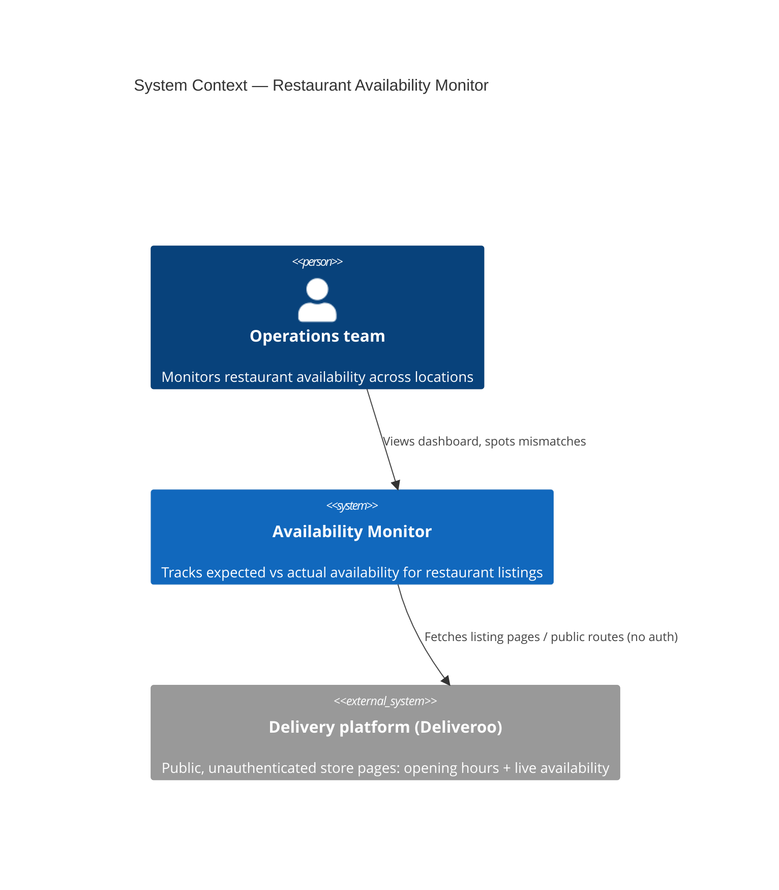
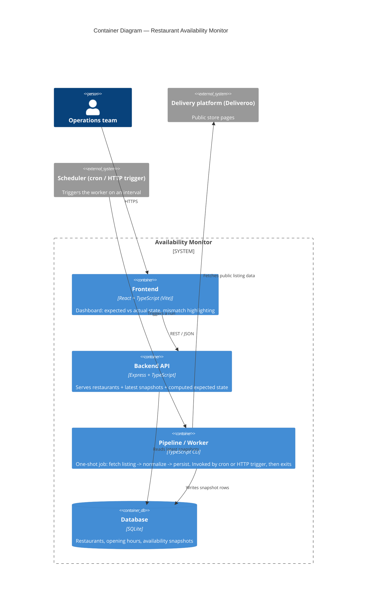

# Architecture

## C1 — System Context

Who uses the system, and which external system it depends on.

Constraint: the monitor only ever calls public, unauthenticated routes on the delivery platform — no login, no private API keys, no bypassing bot protection.

## C2 — Container

How the system is split into independently deployable/runnable pieces.

Notes:
- `frontend`, `backend`, and `worker` are separate apps in the monorepo (`apps/frontend`, `apps/backend`, `apps/worker`), each with its own `package.json` and start script, so they can be started/deployed independently.
- `worker` is not a long-running server: it runs once per invocation and exits, matching the "cron job or HTTP request" execution model from the brief.
- `backend` never talks to the delivery platform directly — only `worker` does. This keeps the read path (dashboard) fast and decoupled from platform flakiness.

## Still to fill in (later iterations)

- **Resilience & health**: how failures in the worker (unreachable platform, malformed response) are surfaced, retried, and alerted on.
- **Data currency at scale**: design for near real-time accuracy across tens of thousands of restaurants.
- **Real-time notifications**: how ops gets alerted on expected/actual mismatches.
- **Cost estimate** at 10,000 tracked restaurants.
- **Code-to-architecture mapping**: how this repo's apps map onto the production design above.
