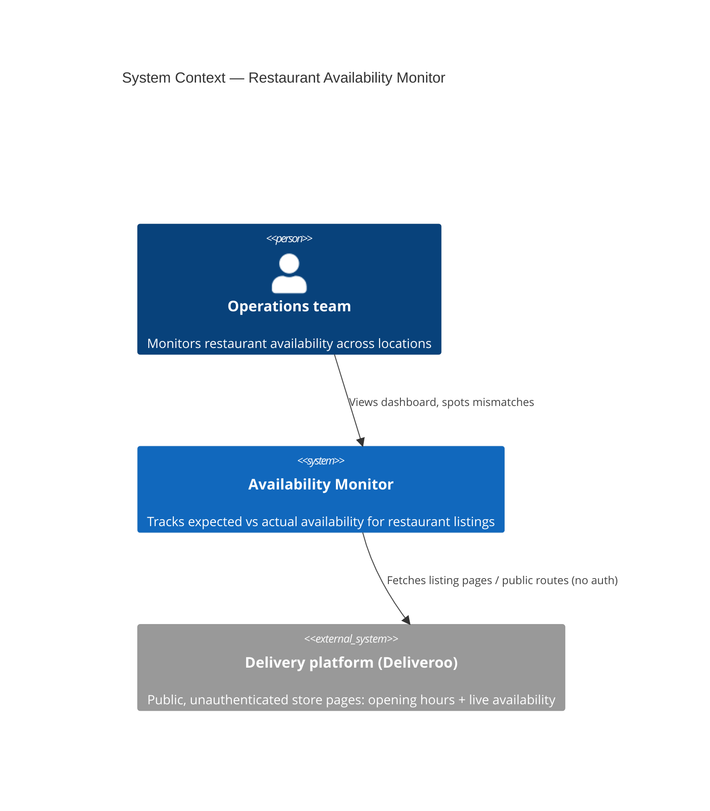
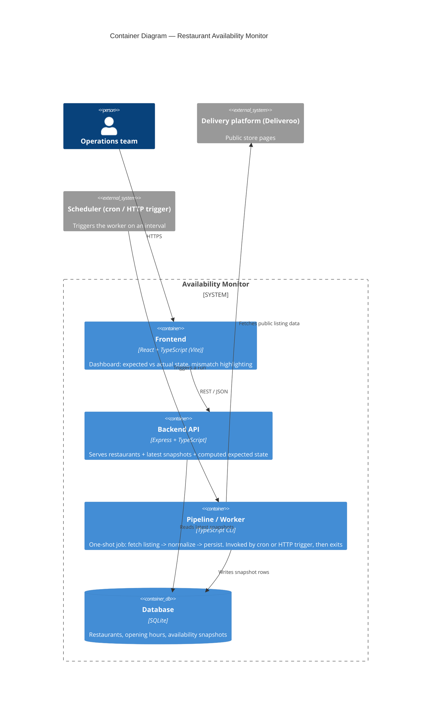

# Architecture

## C1 — System Context

Who uses the system, and which external system it depends on.

Constraint: the monitor only ever calls public, unauthenticated routes on the delivery platform — no login, no private API keys, no bypassing bot protection.

## C2 — Container

How the system is split into independently deployable/runnable pieces.

Notes:
- `frontend`, `backend`, and `worker` are separate apps in the monorepo (`apps/frontend`, `apps/backend`, `apps/worker`), each with its own `package.json` and start script, so they can be started/deployed independently.
- `worker` is not a long-running server by default: `run.ts` is a one-shot CLI (cron-friendly), and `httpServer.ts` exposes the same logic behind `POST /run` for schedulers that trigger over HTTP — matching the brief's "cron job or HTTP request" execution model either way.
- `backend` never talks to the delivery platform directly — only `worker` does. This keeps the read path (dashboard) fast and decoupled from platform flakiness.

## Production architecture

### Resilience, and knowing when it's unhealthy

- **Fault isolation already in the code**: each restaurant is fetched/normalized/persisted independently ([pipeline.ts](../apps/worker/src/pipeline.ts)) — one bad listing (unreachable, malformed) can't take down the rest of the run. This is the highest-leverage resilience decision and it's tested ([pipeline.test.ts](../apps/worker/src/pipeline.test.ts)).
- **Two trigger paths**: the worker runs as a one-shot CLI (`run.ts`, cron-friendly) or via an HTTP trigger (`httpServer.ts`, `POST /run`) — both call the same `runOnce()`, so a scheduler (cron, EventBridge, Cloud Scheduler) can invoke it either way without duplicating logic.
- **Health checks**: `backend` and the worker's HTTP server both expose `/health` for uptime probes/load balancers. In production I'd add a `/health/ready` that checks DB connectivity specifically, so a load balancer can distinguish "process is up" from "can actually serve data."
- **Staleness as a health signal, not just availability**: right now the dashboard trusts whatever the latest snapshot says, however old it is. A restaurant whose pipeline run has been silently failing for hours looks identical to one that's genuinely open. In production I'd surface "last checked N minutes ago" prominently and treat "no snapshot within 2x the polling interval" as its own alertable state, separate from an availability mismatch. **This is a real gap in the current build** — noted in the decision log.
- **Observability**: structured per-restaurant success/failure logging already exists; in production this becomes metrics (success rate, live-vs-fixture ratio, fetch latency per restaurant/chain) shipped to CloudWatch/Prometheus, with alerts on success-rate drops or a chain going entirely dark.
- **Retries**: transient network failures currently fall straight through to the fixture. In production I'd add a short retry-with-backoff on the live fetch before falling back, since not every live failure is "the platform blocks us forever" — some are just a dropped connection.

### Data currency at scale (tens of thousands of restaurants)

- The current design (one process looping sequentially over 5 restaurants) doesn't scale past a few hundred without stretching each polling cycle unacceptably. The fix is **fan-out via a queue**: a scheduler enqueues restaurant IDs (or chain batches) onto SQS/Pub-Sub, and a pool of stateless worker consumers (Lambda, Cloud Run, or ECS tasks) each pull one message, run the existing `runOnce`-style fetch/normalize/persist for that restaurant, and exit. Wall-clock time per cycle is then bounded by consumer concurrency, not restaurant count.
- **Tiered polling frequency**: not every restaurant needs the same cadence — high-volume/flagship locations every 2-5 minutes, long-tail locations every 15-30 minutes. This keeps total request volume against the platform (and any rate limits/bot-detection thresholds) manageable as restaurant count grows.
- The write path is already idempotent (`upsertRestaurant` + append-only `availability_snapshots`), so concurrent workers writing to a shared database requires no coordination beyond the DB itself.
- **Database**: SQLite is a local-dev/demo choice, not a production one — a single-writer file DB won't handle concurrent workers at this volume. Production uses Postgres (RDS/Cloud SQL) with pooled connections, indexed on `(restaurant_id, fetched_at)` as already modelled here.
- **Read path**: the backend currently computes `expectedState` and joins the latest snapshot on every request — fine at 5 rows, not at 10k+ with a growing snapshot history. Production would precompute "current status" at write-time (in the worker, right after persisting a snapshot) into a small denormalized table or cache (Redis), so dashboard reads stay O(restaurants), not O(restaurants × history).

### Real-time notifications on mismatch

- Move mismatch detection from the backend's read-time computation to **write-time, in the worker**, immediately after persisting each snapshot (same `computeExpectedState` logic from `packages/shared`, reused rather than duplicated).
- On a **state transition** into mismatch (not on every poll while still mismatched), publish an event to a pub/sub topic (SNS/EventBridge/Kafka topic, keyed by restaurant).
- A separate lightweight notifier service subscribes to that topic and fans out to Slack/Teams webhooks for the ops channel, and to PagerDuty/Opsgenie for on-call escalation on sustained mismatches. Debounce so a restaurant flapping in and out of mismatch doesn't spam the channel; send a periodic "still mismatched" digest instead of re-alerting every cycle.
- Track acknowledgement state (who's looked at it) so the dashboard can distinguish "new" from "already being handled" mismatches — this avoids alert fatigue being the thing that kills the tool's usefulness.
- For the dashboard itself, push updates over WebSocket/SSE from the same event stream instead of polling, so ops sees a mismatch the moment it's detected rather than waiting for the next manual refresh.

### Cost at 10,000 tracked restaurants

Rough order-of-magnitude, assuming a 5-minute average polling interval (tiered per the scaling section above):

- **Fetch volume**: ~12 fetches/hour/restaurant × 10,000 = ~120k/hour, ~2.9M/day, ~86M/month.
- **Compute** (serverless workers, ~1-2s per fetch, 256-512MB): low hundreds of dollars/month for plain HTTP fetches. **This is the single biggest cost risk**: if getting real (non-fixture) data ever requires headless-browser rendering — plausible, since we confirmed Deliveroo's listing pages are client-rendered and return 403 to plain server-side fetches — per-fetch cost and duration go up roughly 10-50x, which could push compute into the low thousands/month instead. Worth validating with a real spike before committing to a polling frequency at this scale.
- **Database** (managed Postgres, small-to-medium instance): ~$50-150/month; snapshot history is the main growth driver, mitigated by a retention policy (e.g. 30 days raw, rolled up to daily summaries beyond that).
- **Messaging** (queue + pub/sub for fan-out and notifications): usage-based, likely under $50/month at this volume.
- **API + frontend hosting**: small always-on instance or serverless API, ~$20-50/month.
- **Total**: low-to-mid hundreds of dollars/month if plain-HTTP fetching holds up; potentially low thousands if headless rendering becomes necessary. The two real levers are polling frequency per restaurant tier and snapshot retention — both are configuration, not architecture, changes.

### How this code fits the production picture

- `apps/worker` is the fetch → normalize → persist container from the diagrams above, runnable today as a CLI (cron) or via its `POST /run` HTTP trigger — in production this becomes the queue-consumer, invoked by a message instead of a CLI/HTTP call, but running the exact same `runOnce()`/`pipeline.ts` logic.
- `apps/backend` is the Backend API container; today it computes expected state and joins the latest snapshot per request. The production evolution (write-time mismatch detection, a denormalized status table/cache) slots in without changing the API's external shape — the frontend keeps calling `GET /restaurants`.
- `apps/frontend` is unchanged in shape between local dev and production: same React SPA, pointed at a different API URL, optionally upgraded to consume a WebSocket/SSE stream for live updates instead of the current manual-refresh model.
- `packages/shared` holds the domain types, opening-hours comparison logic, and DB access shared across worker and backend today — in production this is exactly the logic reused between the write-time notification check and the read-time API, so "what triggers an alert" and "what the dashboard shows" can never drift apart.
